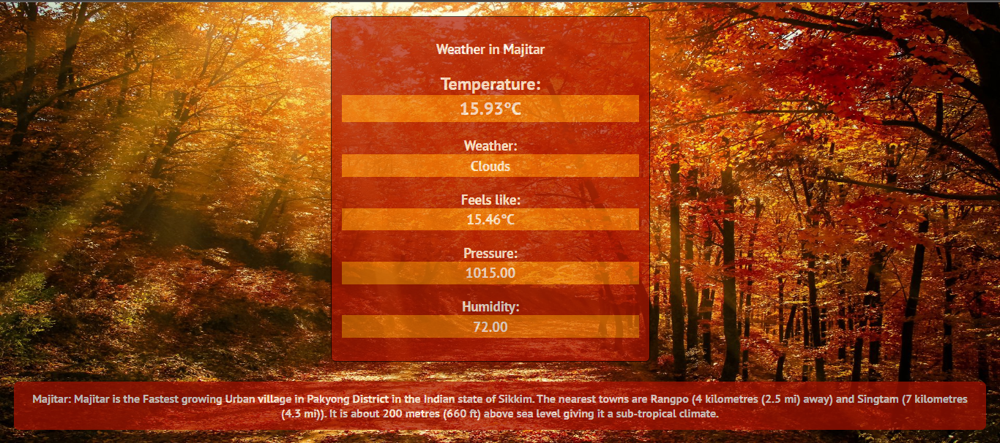
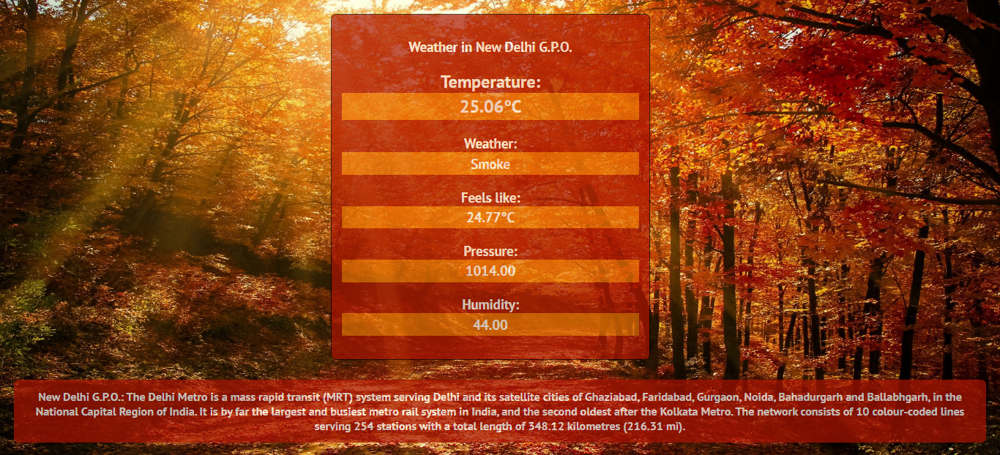
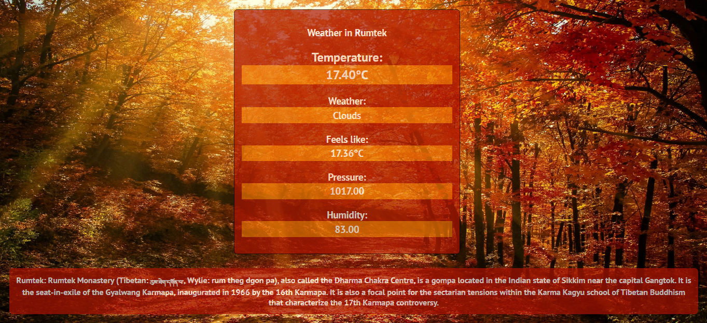

# Weather Forecast

* Used OpenWeatherMap to request API calls for weather based on the PIN Code of an area entered by the user. 
* Employed flask to deploy the app and to send data from one route to another.
* Also used wikipedia module in Python to give a short information about the place as found from the API request.
* Used HTML & CSS for Front-end. 
## Homepage

## Result Pages
### Pin Code: 737136

### Pin Code: 110001

### Pin Code: 737135

